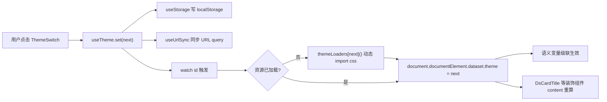

# tt-qimen 技术架构方案

> 适用范围：`design/prototypes/{guofeng,minimal}` 多页 HTML 原型 → 正式 Vue 3 + Vite SPA 的工程化落地。
> 核心约束："一套基础逻辑 + 多套样式与文案"，主题（国风 / 现代简约 / 预留扩展）与语言（zh-CN / zh-TW / en）皆可热切换。

---

## 目录

1. [概述与目标](#1-概述与目标)
2. [技术选型与理由](#2-技术选型与理由)
3. [项目目录结构](#3-项目目录结构)
4. [主题系统设计](#4-主题系统设计可扩展配置化)
5. [国际化（i18n）方案](#5-国际化i18n方案zh-cnzh-twen)
6. [路由与页面拆分](#6-路由与页面拆分)
7. [状态管理（Pinia）](#7-状态管理pinia)
8. [数据层与计算引擎](#8-数据层与计算引擎)
9. [构建、部署、性能预算](#9-构建部署性能预算)
10. [渐进迁移路线（HTML → Vue）](#10-渐进迁移路线html-原型--vue-组件)
11. [工程规范（已装 skill 的落地约束）](#11-工程规范已装-skill-的落地约束)
12. [风险与权衡](#12-风险与权衡)

---

## 1. 概述与目标

### 1.1 现状

| 项 | 现状 |
|---|---|
| 形态 | 纯多页 HTML 原型，每模块两套（`design/prototypes/guofeng/*.html`、`design/prototypes/minimal/*.html`） |
| 样式 | CSS Variables 已抽到 `design/prototypes/assets/{guofeng,minimal}.css`，命名前缀 `--gf-*` / `--mn-*` |
| 通用类 | `.ds-*`（design-system）原子类已在两套 css 中实现，但**命名不互通**（业务类直接绑某主题） |
| 文案 | 简体散落在 HTML 中，已出现少量繁体（如 `guofeng/bazi.html#L995`），无 i18n |
| 模块 | 8 个（八字、紫微、小六壬、称骨、灵签、姓名学、黄历、解梦） |

### 1.2 目标

1. **代码复用**：所有业务逻辑（排盘计算、命盘渲染、SVG 关系线）只写一次。
2. **主题可热切换**：用户在顶栏即可在多套主题间切换，不刷新页面。
3. **多语言**：zh-CN / zh-TW / en 三语，按需懒加载。
4. **可扩展**：新增 1 个主题 = 新增 1 个 `themes/<id>/` 目录；新增 1 种语言 = 新增 1 个 `locales/<lang>.ts`。
5. **静态部署**：纯静态产物，可托管在 GitHub Pages / Vercel / Cloudflare Pages。
6. **性能可控**：首屏 JS gzip ≤ 80KB，主题切换 < 100ms，语言切换 < 200ms。

### 1.3 非目标

- 后端服务与账号体系（MVP 不做）
- SSR / SEO 深度优化（占卜类内容 SEO 价值有限）
- 复杂可视化引擎（继续用 SVG，不引入 D3 / ECharts）

---

## 2. 技术选型与理由

| 类别 | 选型 | 理由 |
|---|---|---|
| 框架 | Vue 3 + `<script setup>` + Composition API | 团队熟悉度、`<script setup>` 模板心智简洁、与已装 `antfu/vue` skill 完全对齐 |
| 构建 | Vite 5 | ESM 原生开发体验、Rollup 生产构建、与已装 `antfu/vite` skill 对齐 |
| 路由 | Vue Router 4（hash 模式） | hash 模式无需服务器 rewrite，纯静态部署最稳；URL 可携带 `?theme&lang` 分享 |
| 状态 | Pinia | Vue 官方推荐、TS 友好、单文件 store |
| i18n | vue-i18n 9（Composition API 模式） | 官方主流方案、按需懒加载语言包 |
| 类型 | TypeScript（strict） | 八字/紫微的领域模型复杂，类型保护是必需 |
| 工具库 | `@vueuse/core` | 已装 `antfu/vueuse-functions` skill；`useStorage`、`useDark`、`useEventListener` 等覆盖 90% 副作用场景 |
| 农历计算 | `lunar-typescript` | 八字、黄历、择日所需的天干地支/节气/纳音/真太阳时计算，开源且 TS 类型完整 |
| 测试 | Vitest + Vue Test Utils + Playwright | Vitest 与 Vite 同源；Playwright 已有本地 skill |
| 部署 | 任一静态托管 | 产物为 `dist/` 静态文件 |
| 包管理 | pnpm | 节省磁盘、严格依赖、monorepo 友好（如未来拆 `@tt-qimen/engine`） |

**显式不选的方案**：

- **Nuxt 3**：占卜内容不需要 SSR/SEO，多余复杂度。
- **VitePress / Astro**：无法满足表单交互、状态管理、SVG 动态渲染的复杂度。
- **Tailwind**：现有 token 体系（`--gf-*` / `--mn-*`）与多主题契约更精确，引入 Tailwind 反而打破 token 抽象。
- **Element Plus / Naive UI**：组件库的视觉强假设会冲突国风风格，自建 `Ds*` 原子组件成本可控。

---

## 3. 项目目录结构

```
tt-qimen/
├── public/                      静态资源（favicon、字体子集、装饰图）
│   ├── fonts/
│   │   ├── kaiti-subset.woff2   楷体子集（仅占卜常用字）
│   │   └── inter-subset.woff2
│   └── decor/
│       ├── seal-cinnabar.svg    朱砂印章
│       └── paper-texture.png    宣纸纹理
├── src/
│   ├── main.ts                  入口（注册 pinia / router / i18n / theme）
│   ├── App.vue                  根（顶栏 ThemeSwitch + LangSwitch + RouterView）
│   ├── env.d.ts
│   │
│   ├── router/
│   │   └── index.ts             路由表（lazy + meta）
│   │
│   ├── stores/                  Pinia
│   │   ├── theme.ts             当前主题 + 切换逻辑
│   │   ├── locale.ts            当前语言 + 懒加载逻辑
│   │   ├── user.ts              用户输入的生辰（持久化）
│   │   └── divination.ts        各模块的计算结果缓存
│   │
│   ├── themes/                  主题包
│   │   ├── _shared/
│   │   │   ├── base.css         reset、layout、a11y
│   │   │   └── contracts.css    所有主题必须实现的语义变量清单（见 §4.2）
│   │   ├── guofeng/
│   │   │   ├── tokens.css       --color-*, --font-*, --space-*, --ornament-*
│   │   │   ├── components.css   .ds-card, .ds-input, .ds-button 在该主题下的样式
│   │   │   ├── decorations.css  宣纸纹理、印章、卷轴角等装饰
│   │   │   └── meta.ts          { id, displayName, ornaments, fonts, preview }
│   │   ├── minimal/
│   │   │   ├── tokens.css
│   │   │   ├── components.css
│   │   │   ├── decorations.css  （留空或最小化）
│   │   │   └── meta.ts
│   │   └── index.ts             导出 themeRegistry 与 ThemeId
│   │
│   ├── locales/                 i18n
│   │   ├── index.ts             setupI18n + loadLocale
│   │   ├── zh-CN.ts             默认（编译进主包）
│   │   ├── zh-TW.ts             懒加载
│   │   ├── en.ts                懒加载
│   │   └── modules/             按模块拆分
│   │       ├── bazi.zh-CN.ts
│   │       ├── bazi.zh-TW.ts
│   │       ├── bazi.en.ts
│   │       ├── ziwei.*.ts
│   │       └── ...
│   │
│   ├── composables/
│   │   ├── useTheme.ts          切换主题、应用 data-theme
│   │   ├── useLocale.ts         切换语言、懒加载语言包
│   │   ├── useDivination.ts     调度各模块 engine
│   │   ├── useLunar.ts          公历↔农历、干支、节气
│   │   ├── useRelationLines.ts  SVG 关系线绘制（八字、紫微通用）
│   │   └── useUrlSync.ts        ?theme=&lang= ↔ store 双向同步
│   │
│   ├── components/
│   │   ├── ds/                  主题无关原子组件
│   │   │   ├── DsButton.vue
│   │   │   ├── DsCard.vue
│   │   │   ├── DsCardTitle.vue  自动读 --ornament-h-prefix/suffix
│   │   │   ├── DsInput.vue
│   │   │   ├── DsSelect.vue
│   │   │   ├── DsBadge.vue
│   │   │   ├── DsSwitch.vue
│   │   │   ├── DsContainer.vue
│   │   │   └── DsOrnament.vue   装饰符号（◈ · ✦ 等，按主题切）
│   │   ├── form/
│   │   │   └── BirthForm.vue    统一年/月/日/时输入（替代各模块自写）
│   │   ├── chart/
│   │   │   ├── ElementsRadar.vue        五行雷达
│   │   │   ├── FourPillars.vue          四柱命盘（含关系线）
│   │   │   ├── ZiweiBoard.vue           紫微12宫
│   │   │   └── DayunTimeline.vue        大运时间轴
│   │   └── layout/
│   │       ├── AppHeader.vue            顶栏
│   │       ├── ThemeSwitch.vue
│   │       └── LangSwitch.vue
│   │
│   ├── modules/                 业务模块（每模块自包含）
│   │   ├── bazi/
│   │   │   ├── BaziPage.vue
│   │   │   ├── components/
│   │   │   ├── engine/          纯函数计算（无 UI 依赖）
│   │   │   │   ├── pillar.ts    四柱
│   │   │   │   ├── shishen.ts   十神
│   │   │   │   ├── nayin.ts     纳音
│   │   │   │   ├── element.ts   五行旺衰
│   │   │   │   ├── relations.ts 冲合刑害
│   │   │   │   └── dayun.ts     大运排盘
│   │   │   └── i18n.ts          模块 messages 入口
│   │   ├── ziwei/               同上结构
│   │   ├── liuren/
│   │   ├── chenggu/
│   │   ├── lingqian/
│   │   ├── xingming/
│   │   ├── huangli/
│   │   └── jiemeng/
│   │
│   ├── lib/                     通用纯函数
│   │   ├── datetime.ts          日期工具
│   │   ├── lunar.ts             封装 lunar-typescript
│   │   ├── sexagenary.ts        干支六十甲子
│   │   └── solar-time.ts        真太阳时校正（经度）
│   │
│   └── styles/
│       ├── reset.css
│       └── tokens-contract.css  仅声明语义变量名（编辑器/类型提示用）
│
├── tests/
│   ├── unit/                    Vitest（engine 纯函数）
│   └── e2e/                     Playwright（主题切换、语言切换、排盘流程）
│
├── index.html
├── package.json
├── pnpm-lock.yaml
├── vite.config.ts
├── tsconfig.json
├── tsconfig.node.json
├── .eslintrc.cjs                @antfu/eslint-config
├── .gitignore
└── README.md
```

---

## 4. 主题系统设计（可扩展配置化）

### 4.1 核心思路

把现有 `assets/{guofeng,minimal}.css` 已抽好的 token 升级为**主题包**，对外只暴露一套**语义变量契约**；业务组件只用契约名，不用 `--gf-*` / `--mn-*`，从而：

- 切主题 = 切一组 CSS 变量值，DOM 不重建
- 加主题 = 新增一个 `themes/<id>/` 目录实现契约
- 装饰差异（印章、纹理、装饰符号）通过专用 token 与可选装饰组件承载，不污染业务组件

### 4.2 语义变量契约 `themes/_shared/contracts.css`

任何主题的 `tokens.css` **必须**实现下列变量（不可缺）。业务侧 / `Ds*` 组件**只能引用**下列名字：

```css
:root[data-theme] {
  /* ============ 颜色 ============ */
  --color-bg:           background-color of body
  --color-bg-elev:      background of elevated surface (cards)
  --color-surface:      same-level surface tint
  --color-border:       hairline border
  --color-border-strong:emphasized border / focus

  --color-ink:          primary text
  --color-ink-soft:     secondary text
  --color-ink-muted:    tertiary text / placeholder
  --color-ink-inverse:  text on accent surface

  --color-accent:       brand / interactive primary
  --color-accent-hover:
  --color-accent-soft:  accent tint (selected bg)
  --color-accent-on:    text on accent surface (alias of ink-inverse for accent)

  --color-success:
  --color-warning:
  --color-danger:
  --color-info:

  /* 占卜五行专色（业务必用） */
  --color-element-wood:
  --color-element-fire:
  --color-element-earth:
  --color-element-metal:
  --color-element-water:

  /* 关系线专色 */
  --color-relation-chong:    冲
  --color-relation-he:       合
  --color-relation-xing:     刑
  --color-relation-anhe:     暗合

  /* ============ 字体 ============ */
  --font-display:       标题/装饰字体（国风=楷体，简约=Inter）
  --font-body:          正文
  --font-mono:          代码/数字
  --font-en:            英文专用（国风=Garamond）

  /* ============ 间距（统一 8pt 网格） ============ */
  --space-1:  4px
  --space-2:  8px
  --space-3: 12px
  --space-4: 16px
  --space-5: 20px
  --space-6: 24px
  --space-8: 32px
  --space-10:40px
  --space-12:48px
  --space-16:64px

  /* ============ 圆角 ============ */
  --radius-sm: 国风 2px / 简约 6px
  --radius-md: 国风 4px / 简约 10px
  --radius-lg: 国风 8px / 简约 16px
  --radius-xl: 国风 12px/ 简约 24px

  /* ============ 阴影 ============ */
  --shadow-sm:
  --shadow-md:
  --shadow-lg:

  /* ============ 装饰 token（主题表达力的关键） ============ */
  --ornament-h-prefix:   '"◈ "'   /* 标题前缀符号，可为空 */
  --ornament-h-suffix:   '" ◈"'
  --ornament-divider:    'url(...)' /* 卷轴分隔线背景图 */
  --ornament-corner:     'url(...)' /* 卡片四角装饰 */
  --texture-bg:          'url(...)' /* 背景纹理（宣纸） */
  --seal-image:          'url(...)' /* 印章图 */

  /* ============ 动效 ============ */
  --transition-fast:  120ms cubic-bezier(0.4, 0, 0.2, 1)
  --transition-base:  200ms cubic-bezier(0.4, 0, 0.2, 1)
  --transition-slow:  320ms cubic-bezier(0.4, 0, 0.2, 1)
}
```

### 4.3 主题包示例：`themes/guofeng/tokens.css`

```css
:root[data-theme='guofeng'] {
  --color-bg:           #f6ecd6;
  --color-bg-elev:      #fffbf0;
  --color-surface:      #f6ecd6;
  --color-border:       #b08d3b;
  --color-border-strong:#8f2116;

  --color-ink:          #1a1613;
  --color-ink-soft:     #3a322c;
  --color-ink-muted:    #8a7a5a;
  --color-ink-inverse:  #fffbf0;

  --color-accent:       #c23a2a;
  --color-accent-hover: #8f2116;
  --color-accent-soft:  #f3d9d4;
  --color-accent-on:    #fffbf0;

  --color-success:      #4a6d5d;
  --color-warning:      #b08d3b;
  --color-danger:       #c23a2a;
  --color-info:         #4a6d8f;

  --color-element-wood:  #4a6d5d;
  --color-element-fire:  #c23a2a;
  --color-element-earth: #b08d3b;
  --color-element-metal: #b8a878;
  --color-element-water: #4a6d8f;

  --color-relation-chong: #c23a2a;
  --color-relation-he:    #4a6d5d;
  --color-relation-xing:  #a3231b;
  --color-relation-anhe:  #4a6d5d;

  --font-display: 'Kaiti', 'STKaiti', 'LXGW WenKai', 'Noto Serif SC', serif;
  --font-body:    'Kaiti', 'STKaiti', 'Noto Serif SC', serif;
  --font-mono:    ui-monospace, monospace;
  --font-en:      'Cormorant Garamond', 'EB Garamond', Georgia, serif;

  --space-1: 4px;  --space-2: 8px;  --space-3: 12px; --space-4: 16px;
  --space-5: 20px; --space-6: 24px; --space-8: 32px; --space-10: 40px;
  --space-12: 48px; --space-16: 64px;

  --radius-sm: 2px; --radius-md: 4px; --radius-lg: 8px; --radius-xl: 12px;

  --shadow-sm: 0 2px 8px rgba(26, 22, 19, 0.08);
  --shadow-md: 0 6px 20px rgba(26, 22, 19, 0.12);
  --shadow-lg: 0 12px 40px rgba(26, 22, 19, 0.16);

  --ornament-h-prefix: '◈ ';
  --ornament-h-suffix: ' ◈';
  --ornament-divider:  url('/decor/divider-cinnabar.svg');
  --ornament-corner:   url('/decor/corner-scroll.svg');
  --texture-bg:        url('/decor/paper-texture.png');
  --seal-image:        url('/decor/seal-cinnabar.svg');

  --transition-fast: 120ms cubic-bezier(0.4, 0, 0.2, 1);
  --transition-base: 200ms cubic-bezier(0.4, 0, 0.2, 1);
  --transition-slow: 320ms cubic-bezier(0.4, 0, 0.2, 1);
}
```

`themes/minimal/tokens.css` 同结构，值替换为简约风格（背景白、强调色 `#3b2f63` 深紫、字体 Inter、装饰符号 `· ·` 或为空）。

### 4.4 主题元数据 `themes/<id>/meta.ts`

```ts
import type { ThemeMeta } from '@/themes/types'

export const meta: ThemeMeta = {
  id: 'guofeng',
  displayName: { 'zh-CN': '国风', 'zh-TW': '國風', 'en': 'Heritage' },
  description: {
    'zh-CN': '宣纸朱砂楷体',
    'zh-TW': '宣紙朱砂楷體',
    'en': 'Rice paper, cinnabar, kaiti',
  },
  preview: '/decor/preview-guofeng.png',
  features: {
    hasTexture: true,
    hasSeal: true,
    decorativeOrnament: true,
  },
} satisfies ThemeMeta
```

### 4.5 主题注册表 `themes/index.ts`

```ts
import { meta as guofeng } from './guofeng/meta'
import { meta as minimal } from './minimal/meta'

export const THEME_IDS = ['guofeng', 'minimal'] as const
export type ThemeId = typeof THEME_IDS[number]

export const themeRegistry: Record<ThemeId, ThemeMeta> = {
  guofeng,
  minimal,
}

// 主题资源懒加载映射（vite 在构建时静态分析）
export const themeLoaders: Record<ThemeId, () => Promise<unknown>> = {
  guofeng: () => Promise.all([
    import('./guofeng/tokens.css'),
    import('./guofeng/components.css'),
    import('./guofeng/decorations.css'),
  ]),
  minimal: () => Promise.all([
    import('./minimal/tokens.css'),
    import('./minimal/components.css'),
    import('./minimal/decorations.css'),
  ]),
}
```

### 4.6 切换 Composable `composables/useTheme.ts`

```ts
import { useStorage } from '@vueuse/core'
import { watch } from 'vue'
import { THEME_IDS, type ThemeId, themeLoaders, themeRegistry } from '@/themes'

const STORAGE_KEY = 'tt-qimen:theme'
const DEFAULT_THEME: ThemeId = 'guofeng'
const loaded = new Set<ThemeId>()

export function useTheme() {
  const id = useStorage<ThemeId>(STORAGE_KEY, DEFAULT_THEME, undefined, {
    serializer: {
      read: (v) => (THEME_IDS.includes(v as ThemeId) ? (v as ThemeId) : DEFAULT_THEME),
      write: (v) => v,
    },
  })

  watch(id, async (next) => {
    if (!loaded.has(next)) {
      await themeLoaders[next]()
      loaded.add(next)
    }
    document.documentElement.dataset.theme = next
  }, { immediate: true })

  return {
    id,
    list: THEME_IDS,
    registry: themeRegistry,
    set: (next: ThemeId) => { id.value = next },
  }
}
```

### 4.7 切换组件 `components/layout/ThemeSwitch.vue`

```vue
<script setup lang="ts">
import { useI18n } from 'vue-i18n'
import { useTheme } from '@/composables/useTheme'

const { id, list, registry, set } = useTheme()
const { locale } = useI18n()
</script>

<template>
  <div class="theme-switch" role="radiogroup" :aria-label="$t('common.theme')">
    <button
      v-for="t in list"
      :key="t"
      role="radio"
      :aria-checked="id === t"
      :class="['theme-switch__opt', { 'is-active': id === t }]"
      @click="set(t)"
    >
      {{ registry[t].displayName[locale] ?? registry[t].displayName['zh-CN'] }}
    </button>
  </div>
</template>

<style scoped>
.theme-switch { display: inline-flex; gap: var(--space-2); }
.theme-switch__opt {
  padding: var(--space-2) var(--space-3);
  border: 1px solid var(--color-border);
  border-radius: var(--radius-md);
  background: var(--color-bg-elev);
  color: var(--color-ink-soft);
  font-family: var(--font-display);
  cursor: pointer;
  transition: var(--transition-fast);
}
.theme-switch__opt.is-active {
  background: var(--color-accent);
  color: var(--color-accent-on);
  border-color: var(--color-accent);
}
</style>
```

### 4.8 装饰组件 `components/ds/DsCardTitle.vue`

```vue
<script setup lang="ts">
defineProps<{ ornament?: boolean }>()
</script>

<template>
  <h2 class="ds-card-title">
    <span v-if="ornament" class="ds-card-title__ornament" aria-hidden="true" />
    <slot />
    <span v-if="ornament" class="ds-card-title__ornament" aria-hidden="true" />
  </h2>
</template>

<style scoped>
.ds-card-title {
  font-family: var(--font-display);
  color: var(--color-accent);
  font-size: 1.25rem;
  display: flex; align-items: center; gap: var(--space-2);
}
.ds-card-title__ornament::before { content: var(--ornament-h-prefix); }
.ds-card-title__ornament:last-child::before { content: var(--ornament-h-suffix); }
</style>
```

> 注：CSS `content` 可读 `var()`，国风出 `◈`，简约出 `·` 或空字符串，**业务组件零改动**。

### 4.9 切换流程图



### 4.10 添加新主题（如 dark / 节日红）的步骤

1. `mkdir src/themes/dark`
2. 复制 `themes/_shared/contracts.css` 注释作为模板
3. 实现 `tokens.css`、`components.css`、可选 `decorations.css`、`meta.ts`
4. 在 `themes/index.ts` 加入 `THEME_IDS` 与 `themeRegistry` / `themeLoaders`
5. 完。业务组件不需改一行。

---

## 5. 国际化（i18n）方案：zh-CN / zh-TW / en

### 5.1 目录结构

```
src/locales/
├── index.ts                 setupI18n + loadLocale
├── zh-CN.ts                 默认（编译进主包）
├── zh-TW.ts                 懒加载
├── en.ts                    懒加载
├── divination-terms.zh-CN.ts  专有术语词典（共享给所有模块）
├── divination-terms.zh-TW.ts
├── divination-terms.en.ts
└── modules/
    ├── bazi.zh-CN.ts
    ├── bazi.zh-TW.ts
    ├── bazi.en.ts
    └── ...（其余 7 模块）
```

### 5.2 `setupI18n` 与懒加载

```ts
// src/locales/index.ts
import { createI18n } from 'vue-i18n'
import zhCN from './zh-CN'
import termsZhCN from './divination-terms.zh-CN'

export const SUPPORT_LOCALES = ['zh-CN', 'zh-TW', 'en'] as const
export type Locale = typeof SUPPORT_LOCALES[number]
export const DEFAULT_LOCALE: Locale = 'zh-CN'

export const i18n = createI18n({
  legacy: false,
  locale: DEFAULT_LOCALE,
  fallbackLocale: DEFAULT_LOCALE,
  messages: {
    'zh-CN': { ...zhCN, terms: termsZhCN },
  },
  datetimeFormats: {
    'zh-CN': { short: { year: 'numeric', month: '2-digit', day: '2-digit' } },
    'zh-TW': { short: { year: 'numeric', month: '2-digit', day: '2-digit' } },
    en:      { short: { year: 'numeric', month: 'short', day: 'numeric' } },
  },
})

const baseLoaders: Record<Locale, () => Promise<{ default: any }>> = {
  'zh-CN': async () => ({ default: zhCN }),
  'zh-TW': () => import('./zh-TW'),
  'en':    () => import('./en'),
}

const termsLoaders: Record<Locale, () => Promise<{ default: any }>> = {
  'zh-CN': async () => ({ default: termsZhCN }),
  'zh-TW': () => import('./divination-terms.zh-TW'),
  'en':    () => import('./divination-terms.en'),
}

const loaded = new Set<Locale>(['zh-CN'])

export async function loadLocale(lang: Locale) {
  if (!loaded.has(lang)) {
    const [base, terms] = await Promise.all([baseLoaders[lang](), termsLoaders[lang]()])
    i18n.global.setLocaleMessage(lang, { ...base.default, terms: terms.default })
    loaded.add(lang)
  }
  i18n.global.locale.value = lang
  document.documentElement.lang = lang
}

export async function loadModuleLocale(moduleId: string, lang: Locale) {
  const key = `${moduleId}@${lang}`
  if (loaded.has(key as any)) return
  const m = await import(`./modules/${moduleId}.${lang}.ts`)
  i18n.global.mergeLocaleMessage(lang, { [moduleId]: m.default })
  loaded.add(key as any)
}
```

### 5.3 `useLocale` Composable

```ts
// src/composables/useLocale.ts
import { useStorage } from '@vueuse/core'
import { watch } from 'vue'
import { DEFAULT_LOCALE, loadLocale, SUPPORT_LOCALES, type Locale } from '@/locales'

const STORAGE_KEY = 'tt-qimen:locale'

function detectInitial(): Locale {
  const saved = localStorage.getItem(STORAGE_KEY) as Locale | null
  if (saved && SUPPORT_LOCALES.includes(saved)) return saved
  const nav = navigator.language
  if (nav.startsWith('zh-TW') || nav.startsWith('zh-HK')) return 'zh-TW'
  if (nav.startsWith('en')) return 'en'
  return DEFAULT_LOCALE
}

export function useLocale() {
  const id = useStorage<Locale>(STORAGE_KEY, detectInitial())
  watch(id, async (next) => { await loadLocale(next) }, { immediate: true })
  return { id, list: SUPPORT_LOCALES, set: (l: Locale) => { id.value = l } }
}
```

### 5.4 文案抽取规则

| 原 HTML 写法 | 抽取后 |
|---|---|
| `<h2>排盘 · 乾造</h2>` | `<h2>{{ $t('bazi.title.male') }}</h2>` |
| `placeholder="请输入年份"` | `:placeholder="$t('common.placeholder.year')"` |
| 占卜术语（八字、十神、纳音…） | 走 `terms` 命名空间：`$t('terms.shishen.zhengcai')` |
| 数字+单位（"23 岁"） | `$t('common.age', { n: 23 })` 配 `messages: { 'zh-CN': { age: '{n} 岁' }, en: { age: '{n} y/o' } }` |
| 日期 | `$d(date, 'short')`，由 `datetimeFormats` 控制本地化 |

### 5.5 术语词典样例

```ts
// locales/divination-terms.zh-CN.ts
export default {
  shishen: {
    zhengcai: '正财', piancai: '偏财', zhengguan: '正官', pianguan: '偏官',
    zhengyin: '正印', pianyin: '偏印', shishen: '食神', shanguan: '伤官',
    bijian: '比肩', jiecai: '劫财', rizhu: '日主',
  },
  wuxing: { wood: '木', fire: '火', earth: '土', metal: '金', water: '水' },
  tiangan: ['甲', '乙', '丙', '丁', '戊', '己', '庚', '辛', '壬', '癸'],
  dizhi:   ['子', '丑', '寅', '卯', '辰', '巳', '午', '未', '申', '酉', '戌', '亥'],
  relation: { chong: '相冲', he: '相合', xing: '相刑', anhe: '暗合', zixing: '自刑' },
}
```

```ts
// locales/divination-terms.zh-TW.ts
export default {
  shishen: {
    zhengcai: '正財', piancai: '偏財', zhengguan: '正官', pianguan: '偏官',
    zhengyin: '正印', pianyin: '偏印', shishen: '食神', shanguan: '傷官',
    bijian: '比肩', jiecai: '劫財', rizhu: '日主',
  },
  wuxing: { wood: '木', fire: '火', earth: '土', metal: '金', water: '水' },
  tiangan: ['甲', '乙', '丙', '丁', '戊', '己', '庚', '辛', '壬', '癸'],
  dizhi:   ['子', '丑', '寅', '卯', '辰', '巳', '午', '未', '申', '酉', '戌', '亥'],
  relation: { chong: '相沖', he: '相合', xing: '相刑', anhe: '暗合', zixing: '自刑' },
}
```

```ts
// locales/divination-terms.en.ts
export default {
  shishen: {
    zhengcai: 'Direct Wealth (Zheng Cai)',
    piancai:  'Indirect Wealth (Pian Cai)',
    zhengguan:'Direct Officer (Zheng Guan)',
    pianguan: 'Seven Killings (Pian Guan / Qi Sha)',
    zhengyin: 'Direct Resource (Zheng Yin)',
    pianyin:  'Indirect Resource (Pian Yin / Xiao Shen)',
    shishen:  'Eating God (Shi Shen)',
    shanguan: 'Hurting Officer (Shang Guan)',
    bijian:   'Friend (Bi Jian)',
    jiecai:   'Rob Wealth (Jie Cai)',
    rizhu:    'Day Master',
  },
  wuxing: { wood: 'Wood', fire: 'Fire', earth: 'Earth', metal: 'Metal', water: 'Water' },
  tiangan: ['Jiǎ','Yǐ','Bǐng','Dīng','Wù','Jǐ','Gēng','Xīn','Rén','Guǐ'],
  dizhi:   ['Zǐ','Chǒu','Yín','Mǎo','Chén','Sì','Wǔ','Wèi','Shēn','Yǒu','Xū','Hài'],
  relation: { chong: 'Clash', he: 'Combine', xing: 'Punish', anhe: 'Hidden Combine', zixing: 'Self-Punish' },
}
```

### 5.6 繁体策略

**手工维护，不用简繁自动转换库**。理由：

- 占卜术语两岸用法已分化（"沖" vs "冲"、"歲" vs "岁"），自动转换会出"傷"误转"商"等专业事故
- 文案量可控（每模块约 200 条）
- 存量繁体字符集可用工具校验：`scripts/lint-locales.ts` 检查 zh-TW 文件不得出现简化字白名单外字符

### 5.7 英文策略

| 类别 | 策略 | 例 |
|---|---|---|
| 模块名 | 拼音 + 副标题 | `Bazi (Eight Characters)`, `Ziwei Dou Shu` |
| 术语 | 直译 + 拼音注 | `Direct Wealth (Zheng Cai)` |
| 五行 | 五行词 + 阶段说明 | `Wu Xing (Five Phases): Wood, Fire, Earth, Metal, Water` |
| 长解读文 | 占位 `(translation in progress)` | 后续逐模块迭代 |
| 数字本地化 | `$n` 格式化 | `2026/4/18` ↔ `Apr 18, 2026` |

### 5.8 URL 同步 `useUrlSync`

```ts
// composables/useUrlSync.ts
import { useRouteQuery } from '@vueuse/router'
import { useTheme } from './useTheme'
import { useLocale } from './useLocale'

export function useUrlSync() {
  const theme = useTheme()
  const locale = useLocale()
  const qTheme = useRouteQuery('theme')
  const qLang  = useRouteQuery('lang')

  if (qTheme.value && (theme.list as readonly string[]).includes(qTheme.value as string))
    theme.set(qTheme.value as any)
  if (qLang.value && (locale.list as readonly string[]).includes(qLang.value as string))
    locale.set(qLang.value as any)

  watch(theme.id,  v => { qTheme.value = v })
  watch(locale.id, v => { qLang.value = v })
}
```

**优先级**：URL `?theme=&lang=` > localStorage > `navigator.language` > `zh-CN` 兜底。
**主题×语言矩阵**：2 主题 × 3 语言 = 6 组合，全部 URL 可分享：

```
#/bazi?theme=guofeng&lang=zh-TW
#/bazi?theme=minimal&lang=en
```

---

## 6. 路由与页面拆分

### 6.1 路由表 `router/index.ts`

```ts
import { createRouter, createWebHashHistory, type RouteRecordRaw } from 'vue-router'
import { loadModuleLocale } from '@/locales'
import { i18n } from '@/locales'

export const MODULES = [
  { id: 'bazi',    icon: '八字', order: 1 },
  { id: 'ziwei',   icon: '紫微', order: 2 },
  { id: 'liuren',  icon: '六壬', order: 3 },
  { id: 'chenggu', icon: '称骨', order: 4 },
  { id: 'lingqian',icon: '灵签', order: 5 },
  { id: 'xingming',icon: '姓名', order: 6 },
  { id: 'huangli', icon: '黄历', order: 7 },
  { id: 'jiemeng', icon: '解梦', order: 8 },
] as const

export type ModuleId = typeof MODULES[number]['id']

const routes: RouteRecordRaw[] = [
  { path: '/', name: 'home', component: () => import('@/modules/home/HomePage.vue'),
    meta: { titleKey: 'home.title' } },
  ...MODULES.map<RouteRecordRaw>(m => ({
    path: `/${m.id}`,
    name: m.id,
    component: () => import(`@/modules/${m.id}/${capitalize(m.id)}Page.vue`),
    meta: { titleKey: `${m.id}.title`, moduleId: m.id, order: m.order },
  })),
  { path: '/:pathMatch(.*)*', name: 'not-found', component: () => import('@/modules/_404.vue') },
]

export const router = createRouter({
  history: createWebHashHistory(),
  routes,
  scrollBehavior: (_to, _from, saved) => saved ?? { top: 0, behavior: 'smooth' },
})

router.beforeEach(async (to) => {
  const moduleId = to.meta.moduleId as string | undefined
  if (moduleId) await loadModuleLocale(moduleId, i18n.global.locale.value as any)
})

router.afterEach((to) => {
  const key = to.meta.titleKey as string | undefined
  document.title = (key ? i18n.global.t(key) : 'tt-qimen') + ' · tt-qimen'
})

function capitalize(s: string) { return s[0].toUpperCase() + s.slice(1) }
```

### 6.2 路由约定

- **lazy 加载**：所有模块 `() => import(...)`，单模块独立 chunk
- **路由进入前**自动加载该模块的 i18n messages（`beforeEach`）
- **滚动**：返回时还原位置
- **meta 字段**：
  - `titleKey`: 用于 `document.title` 与导航
  - `moduleId`: 用于 i18n 模块包加载
  - `order`: 用于顶栏菜单排序
- **不做嵌套路由**：每个模块独立页面，避免主题/i18n 切换时的 keep-alive 复杂性

---

## 7. 状态管理（Pinia）

### 7.1 `stores/theme.ts`

```ts
import { defineStore } from 'pinia'
import { useTheme } from '@/composables/useTheme'

export const useThemeStore = defineStore('theme', () => {
  const { id, list, registry, set } = useTheme()
  return { id, list, registry, set }
})
```

### 7.2 `stores/locale.ts`

```ts
import { defineStore } from 'pinia'
import { useLocale } from '@/composables/useLocale'

export const useLocaleStore = defineStore('locale', () => {
  const { id, list, set } = useLocale()
  return { id, list, set }
})
```

### 7.3 `stores/user.ts`

```ts
import { defineStore } from 'pinia'
import { useStorage } from '@vueuse/core'

export interface BirthInput {
  calendar: 'solar' | 'lunar'
  year: number
  month: number
  day: number
  hour: number          // 0-23
  minute: number        // 0-59
  gender: 'male' | 'female'
  longitude?: number    // 真太阳时校正
  birthplace?: string
}

const DEFAULT: BirthInput = {
  calendar: 'solar', year: 1990, month: 5, day: 20,
  hour: 12, minute: 0, gender: 'male',
}

export const useUserStore = defineStore('user', () => {
  const birth = useStorage<BirthInput>('tt-qimen:birth', DEFAULT, undefined, { mergeDefaults: true })
  function update(patch: Partial<BirthInput>) { birth.value = { ...birth.value, ...patch } }
  function reset() { birth.value = { ...DEFAULT } }
  return { birth, update, reset }
})
```

### 7.4 `stores/divination.ts`

```ts
import { defineStore } from 'pinia'
import { ref } from 'vue'
import type { ModuleId } from '@/router'

export const useDivinationStore = defineStore('divination', () => {
  const cache = ref<Partial<Record<ModuleId, { hash: string; result: unknown }>>>({})
  function get<T>(moduleId: ModuleId, hash: string): T | undefined {
    const hit = cache.value[moduleId]
    return hit && hit.hash === hash ? (hit.result as T) : undefined
  }
  function set<T>(moduleId: ModuleId, hash: string, result: T) {
    cache.value[moduleId] = { hash, result }
  }
  return { cache, get, set }
})
```

> hash 由 birth + moduleId + version 计算，birth 一变即失效。

---

## 8. 数据层与计算引擎

### 8.1 设计原则

- **engine 全部为纯函数**：输入 birth + 选项，输出结构化结果对象，**不依赖 Vue / DOM / store / i18n**
- 所有 engine 单元测试覆盖率 ≥ 90%（Vitest）
- engine 输出**只用 key**（如 `shishen: 'zhengcai'`），不出 UI 文本；UI 层用 `$t('terms.shishen.zhengcai')` 渲染

### 8.2 通用类型 `lib/types.ts`

```ts
export type Stem = 0 | 1 | 2 | 3 | 4 | 5 | 6 | 7 | 8 | 9          // 甲...癸
export type Branch = 0 | 1 | 2 | 3 | 4 | 5 | 6 | 7 | 8 | 9 | 10 | 11  // 子...亥
export type Element = 'wood' | 'fire' | 'earth' | 'metal' | 'water'
export type Gender = 'male' | 'female'

export interface SexagenaryPair { stem: Stem; branch: Branch }
export interface Pillar extends SexagenaryPair {
  hiddenStems: Stem[]    // 藏干
  shishen: ShishenKey    // 该柱十神（相对日主）
  nayin: NayinKey        // 纳音
  element: Element       // 五行
}

export type ShishenKey =
  | 'zhengcai' | 'piancai' | 'zhengguan' | 'pianguan'
  | 'zhengyin' | 'pianyin' | 'shishen'   | 'shanguan'
  | 'bijian'   | 'jiecai'  | 'rizhu'

export type NayinKey =
  | 'haizhongjin' | 'lutangtu' | /* ... 60 个 */ 'tianhe-shui'

export type RelationType = 'chong' | 'he' | 'xing' | 'anhe' | 'zixing'

export interface BranchRelation {
  type: RelationType
  from: Branch
  to: Branch
  positions: [pillarIndex: 0 | 1 | 2 | 3, pillarIndex: 0 | 1 | 2 | 3]
  labelKey: string       // 'bazi.relation.ziwuxiangchong' 之类
}
```

### 8.3 八字 engine 函数签名

```ts
// modules/bazi/engine/pillar.ts
export function calcFourPillars(birth: BirthInput): {
  year: Pillar; month: Pillar; day: Pillar; hour: Pillar
}

// modules/bazi/engine/element.ts
export function calcElementBalance(pillars: ReturnType<typeof calcFourPillars>): {
  scores: Record<Element, number>     // 0..10
  strongest: Element
  weakest: Element
  rizhuStrength: 'too-strong' | 'strong' | 'balanced' | 'weak' | 'too-weak'
}

// modules/bazi/engine/relations.ts
export function calcBranchRelations(pillars: ReturnType<typeof calcFourPillars>): BranchRelation[]

// modules/bazi/engine/dayun.ts
export function calcDayun(birth: BirthInput, pillars: ReturnType<typeof calcFourPillars>): Array<{
  index: number
  startAge: number
  endAge: number
  startYear: number
  endYear: number
  pillar: SexagenaryPair
  shishen: ShishenKey
}>
```

### 8.4 紫微 engine 函数签名

```ts
// modules/ziwei/engine/palace.ts
export function calcZiweiBoard(birth: BirthInput): {
  palaces: Array<{
    index: 0..11
    branch: Branch
    nameKey: 'mingPalace' | 'xiongdi' | ... // 12 宫名
    mainStars: StarKey[]
    auxStars:  StarKey[]
    fourTransform?: 'lu' | 'quan' | 'ke' | 'ji'
  }>
  ming: number   // 命宫索引
  shen: number   // 身宫索引
}

// modules/ziwei/engine/sanfang.ts
export function calcSanfangSizheng(boardIndex: number): {
  sanhe: [number, number, number]   // 三方
  duigong: number                   // 对宫
}
```

### 8.5 其余 6 模块 engine 一览

| 模块 | 入口函数 | 输出主对象 |
|---|---|---|
| 小六壬 liuren | `calcLiuren(time, question)` | `{ palaceKey, interpretationKey }` |
| 称骨 chenggu | `calcChenggu(birth)` | `{ totalLiang, totalQian, poemKey }` |
| 灵签 lingqian | `drawLingqian(seed)` | `{ no, level, poemKey, explanationKey }` |
| 姓名学 xingming | `calcWuge(name)` | `{ tian, ren, di, zong, wai, scoreByGroup }` |
| 黄历 huangli | `calcHuangli(date)` | `{ ganzhi, xiu, shenshaList, yiKeys[], jiKeys[] }` |
| 解梦 jiemeng | `searchDream(query)` | `Array<{ id, titleKey, contentKey }>` |

### 8.6 Composable 调度层 `composables/useDivination.ts`

```ts
export function useDivination<T>(
  moduleId: ModuleId,
  compute: (birth: BirthInput) => T,
) {
  const userStore = useUserStore()
  const cacheStore = useDivinationStore()
  const result = ref<T | null>(null)
  const loading = ref(false)

  async function run() {
    loading.value = true
    try {
      const hash = hashBirth(userStore.birth, moduleId)
      const hit = cacheStore.get<T>(moduleId, hash)
      if (hit) { result.value = hit; return }
      const out = await Promise.resolve().then(() => compute(userStore.birth))
      cacheStore.set(moduleId, hash, out)
      result.value = out
    } finally { loading.value = false }
  }

  return { result, loading, run }
}
```

---

## 9. 构建、部署、性能预算

### 9.1 `vite.config.ts` 关键点

```ts
import { defineConfig } from 'vite'
import vue from '@vitejs/plugin-vue'
import AutoImport from 'unplugin-auto-import/vite'
import Components from 'unplugin-vue-components/vite'
import { resolve } from 'node:path'

export default defineConfig({
  plugins: [
    vue(),
    AutoImport({
      imports: ['vue', 'vue-router', 'vue-i18n', '@vueuse/core', 'pinia'],
      dts: 'src/auto-imports.d.ts',
    }),
    Components({
      dirs: ['src/components/ds', 'src/components/layout'],
      dts: 'src/components.d.ts',
    }),
  ],
  resolve: { alias: { '@': resolve(__dirname, 'src') } },
  build: {
    target: 'es2020',
    cssCodeSplit: true,
    rollupOptions: {
      output: {
        manualChunks: {
          'vendor-vue':  ['vue', 'vue-router', 'pinia'],
          'vendor-i18n': ['vue-i18n'],
          'vendor-vueuse': ['@vueuse/core', '@vueuse/router'],
          'engine-lunar': ['lunar-typescript'],
        },
      },
    },
  },
})
```

### 9.2 性能预算

| 指标 | 预算 | 监控方式 |
|---|---|---|
| 首屏 JS（gzip） | ≤ 80 KB | `vite-bundle-visualizer` |
| 默认主题 CSS（gzip） | ≤ 12 KB | 同上 |
| 默认语言包（gzip） | ≤ 8 KB | 同上 |
| 主题切换耗时 | < 100 ms（已加载）/ < 300 ms（首次懒加载） | Performance API |
| 语言切换耗时 | < 200 ms | 同上 |
| LCP（4G） | < 2 s | Lighthouse CI |

### 9.3 字体策略

- 中文楷体不能直接打包整套（10MB+），用 [`fonttools`](https://github.com/fonttools/fonttools) 生成子集：
  - 通用 2k 高频汉字
  - 占卜术语字符集（天干地支、五行、十神、纳音 60 个、十二宫、星宿名）
- 简约主题用 `Inter` Latin + `Noto Sans SC` 子集
- 字体 `font-display: swap`，避免阻塞渲染

### 9.4 部署

- 产物：`pnpm build` → `dist/`
- 推荐 Cloudflare Pages（CDN 边缘缓存，全球访问）
- `_headers`: 长缓存 hash 文件 `*.[hash].js,css,woff2`，`index.html` 不缓存
- 预渲染：可选用 `vite-plugin-prerender` 预渲染首页 + 8 个模块入口（提升首屏与 SEO）

---

## 10. 渐进迁移路线（HTML 原型 → Vue 组件）

### 10.1 完整映射表

| 现 HTML 原型路径 | → Vue 组件路径 | 优先级 |
|---|---|---|
| `design/prototypes/index.html` | `src/modules/home/HomePage.vue` | P0 |
| `design/prototypes/{guofeng,minimal}/index.html` | 合入 `HomePage.vue`（主题切换驱动） | P0 |
| `design/prototypes/{guofeng,minimal}/bazi.html` | `src/modules/bazi/BaziPage.vue` | P0 |
| `design/prototypes/{guofeng,minimal}/ziwei.html` | `src/modules/ziwei/ZiweiPage.vue` | P0 |
| `design/prototypes/{guofeng,minimal}/liuren.html` | `src/modules/liuren/LiurenPage.vue` | P1 |
| `design/prototypes/{guofeng,minimal}/chenggu.html` | `src/modules/chenggu/ChengguPage.vue` | P1 |
| `design/prototypes/{guofeng,minimal}/lingqian.html` | `src/modules/lingqian/LingqianPage.vue` | P1 |
| `design/prototypes/{guofeng,minimal}/xingming.html` | `src/modules/xingming/XingmingPage.vue` | P2 |
| `design/prototypes/{guofeng,minimal}/huangli.html` | `src/modules/huangli/HuangliPage.vue` | P2 |
| `design/prototypes/{guofeng,minimal}/jiemeng.html` | `src/modules/jiemeng/JiemengPage.vue` | P2 |
| `design/prototypes/assets/guofeng.css` token 段 | `src/themes/guofeng/tokens.css` | P0 |
| `design/prototypes/assets/minimal.css` token 段 | `src/themes/minimal/tokens.css` | P0 |
| `design/prototypes/assets/*.css` 中 `.ds-*` 类 | `src/themes/{guofeng,minimal}/components.css` | P0 |
| `design/prototypes/*/bazi.html` 中的 `drawBaziRelations()` | `src/composables/useRelationLines.ts` | P0 |
| `design/prototypes/*/bazi.html` 中的 `drawFortuneConnectors()` | `src/components/chart/DayunTimeline.vue` 内联 composable | P0 |
| `design/prototypes/*/ziwei.html` 中的 `drawRelations()` | `src/composables/useRelationLines.ts`（共享） | P0 |
| 各页面顶栏导航 | `src/components/layout/AppHeader.vue` | P0 |
| 各页面"录入生辰"卡片 | `src/components/form/BirthForm.vue`（统一） | P0 |

### 10.2 迁移阶段（推荐 3 个 sprint）

#### Sprint 1（骨架）

1. `pnpm create vite tt-qimen --template vue-ts`
2. 装依赖：vue-router, pinia, vue-i18n, @vueuse/core, @vueuse/router, lunar-typescript, unplugin-auto-import, unplugin-vue-components
3. 落地：`src/themes/_shared/contracts.css` + `themes/{guofeng,minimal}/{tokens,components}.css`（直接从 `assets/*.css` 改名前缀）
4. 落地：`src/locales/{index,zh-CN,divination-terms.zh-CN}.ts` 主框架
5. 落地：`src/composables/{useTheme,useLocale,useUrlSync}.ts` + `App.vue` 顶栏
6. 落地：路由表 + Home 页（主题/语言切换可工作）

**验收**：访问 `/`，可在 4 个组合（2 主题 × 2 语言）间无刷切换并 URL 同步。

#### Sprint 2（核心模块）

7. 抽 `BirthForm.vue`（统一年/月/日/时）
8. 抽 `useRelationLines.ts`（八字、紫微通用）
9. 迁移 P0 模块：home / bazi / ziwei
10. 落地八字 engine 全部 + 紫微 engine 全部 + Vitest 覆盖

**验收**：八字、紫微在两套主题、两种语言下完整可用，结果与原 HTML 原型一致。

#### Sprint 3（其余模块 + 国际化补全）

11. 迁移 P1：liuren / chenggu / lingqian
12. 迁移 P2：xingming / huangli / jiemeng
13. 补 zh-TW、en 全部文案
14. 性能优化：字体子集、bundle 分析、prerender
15. 部署到 Cloudflare Pages

**验收**：8 模块 × 2 主题 × 3 语言 = 48 组合可用；Lighthouse 4G 移动端 LCP < 2s。

### 10.3 迁移期共存策略

- 现有 `design/prototypes/` HTML 保留为**视觉与文案的真理源**（设计 review 用）
- Vue 端通过 Playwright 截图比对（已装 `playwright` skill）回归视觉
- 新增功能只在 Vue 端做；HTML 原型只用于"业务方/设计方"对样式微调

---

## 11. 工程规范（已装 skill 的落地约束）

| Skill | 强制约束（在 `CLAUDE.md` / `.cursor/rules` 中固化） |
|---|---|
| `antfu/skills@vue` | 所有 SFC 用 `<script setup lang="ts">`；props 用 `defineProps<{}>()` 泛型语法；emit 用 `defineEmits<{}>()`；不用 Options API |
| `antfu/skills@vue-router-best-practices` | 全部路由 lazy；用 `meta` 不在组件里 hard-code title；`scrollBehavior` 用 saved；不用嵌套 router-view（避免主题切换时的重渲染问题） |
| `antfu/skills@vueuse-functions` | 持久化用 `useStorage`，不手写 localStorage；监听事件用 `useEventListener`；媒体查询用 `useMediaQuery`；暗色检测用 `usePreferredDark`；URL query 用 `useRouteQuery` |
| `antfu/skills@vite` | 用 `unplugin-auto-import` 与 `unplugin-vue-components`；alias `@` → `src/`；生产 manualChunks 见 §9.1 |
| `hyf0/vue-skills@vue-best-practices` | 大数据列表用 `shallowRef`；昂贵列表渲染用 `v-memo`；computed 不写副作用；`provide/inject` 用 `Symbol` key |
| `playwright`（本地） | 任何视觉变更后跑 `tests/e2e/visual.spec.ts` 截图比对 |
| `ui-ux-pro-max`（本地） | 任何 UI 变更前 review（间距、对比度、动效曲线） |

### 11.1 Lint / Format

- ESLint：`@antfu/eslint-config`（与 `antfu/skills` 风格一致）
- 格式化：ESLint 自带 `@stylistic`，不用 Prettier
- Git hooks：`simple-git-hooks` + `lint-staged`

### 11.2 提交规范

- Conventional Commits（`feat:` / `fix:` / `refactor:` / `docs:` / `style:` / `test:` / `chore:`）
- commit message 英文（按用户工作流约定）
- thinking 显示中文

---

## 12. 风险与权衡

| 风险 | 影响 | 缓解 |
|---|---|---|
| 楷体字体子集化漏字 | 国风风格少数生僻字回退到系统字体，破坏视觉 | 字体子集生成时把"占卜术语字符集"+`design/prototypes/**/*.html` 中所有汉字一并纳入 |
| 繁体文案维护成本 | 每模块 ~200 条文案 × 8 模块 = ~1600 条 | 分阶段：MVP 先 zh-CN，zh-TW 二期补；脚本校验"不得出现简体白名单外字符" |
| 英文文案的"翻译还是注释"两难 | 占卜术语硬翻不准、不翻不友好 | 采用"拼音 + 英文释义"双语策略（如 `Zheng Cai (Direct Wealth)`），长解读暂留 `(translation in progress)` |
| 主题切换时装饰图片闪烁 | 国风的宣纸纹理、印章 SVG 首次切换有 200ms 空白 | `<link rel="preload">` 预热默认主题；非默认主题切换时显示淡入过渡 |
| SVG 关系线动态计算依赖 DOM 测量 | SSR 不可用、初次渲染时机敏感 | 不做 SSR；使用 `useResizeObserver`（VueUse）+ `requestAnimationFrame` 重算；测试覆盖窗口缩放场景 |
| 语义变量契约长期维护 | 加新业务样式时绕过契约、直接用 `--gf-*` | ESLint 自定义规则禁止 `var(--gf-` / `var(--mn-` 出现在 `src/components/` 与 `src/modules/`（仅允许出现在 `src/themes/` 内） |
| Vue Router hash 模式 SEO 弱 | 搜索引擎索引困难 | 占卜内容 SEO 价值有限，不投入；如未来需要，切换为 history 模式 + 静态 prerender |
| 用户输入隐私（生辰） | 上传到任何后端会引发隐私担忧 | 全程纯客户端计算，`localStorage` 加密可选；`README` 明示"零上传" |

---

## 附录 A：默认 `package.json` 关键依赖

```json
{
  "dependencies": {
    "vue": "^3.4.0",
    "vue-router": "^4.3.0",
    "pinia": "^2.1.7",
    "vue-i18n": "^9.10.0",
    "@vueuse/core": "^10.9.0",
    "@vueuse/router": "^10.9.0",
    "lunar-typescript": "^1.7.0"
  },
  "devDependencies": {
    "@antfu/eslint-config": "^2.10.0",
    "@vitejs/plugin-vue": "^5.0.0",
    "@vue/test-utils": "^2.4.0",
    "eslint": "^8.57.0",
    "playwright": "^1.42.0",
    "typescript": "~5.4.0",
    "unplugin-auto-import": "^0.17.5",
    "unplugin-vue-components": "^0.26.0",
    "vite": "^5.2.0",
    "vite-bundle-visualizer": "^1.1.0",
    "vitest": "^1.4.0"
  }
}
```

## 附录 B：默认 `.cursor/rules/architecture.mdc` 摘要（待后续创建）

```
- src/components/, src/modules/ 内禁止 var(--gf-, var(--mn-, 必须使用语义变量
- 任何新增主题：必须实现 themes/_shared/contracts.css 列出的全部变量
- 任何新增模块：必须配齐 zh-CN/zh-TW/en 三套 i18n 文件（en 可标 TODO）
- engine/ 目录下文件禁止 import vue / @vueuse / pinia
```

---

**文档版本**：v1.0 · 2026-04-18
**作者**：tt-qimen 架构组
**下一步**：经业务方/设计方 review 通过后，开始 Sprint 1 骨架搭建（不在本轮交付）。
